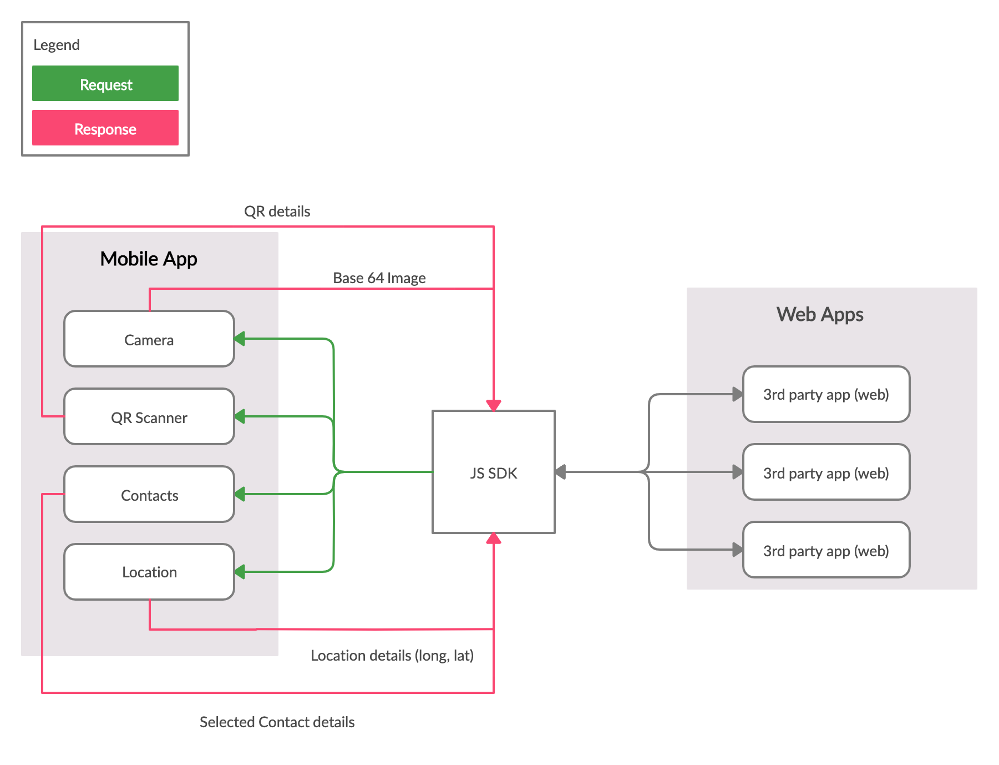

## Introduction

Cliqq allows you to develop your own content to run inside the **Cliqq SuperApp**.

Your App can be developed as a webapp, using standard HTML, Javascript and CSS. While we recommend VueJS it is not mandatory.

This document details a library of functionality that allows your webapp to communicate with the Cliqq SuperApp.

> The super app provides common services that remove friction. Some of the common services are:
  - Common login and identity
  - Common payment method (wallet)
>
> It has two main components:
>
> - Super app container -This is the main application. A native mobile app developed by the owner of the super app. It is designed to provide the common functionalities to be used in the mini apps (login, payment system, notifications, etc.). This includes common framework and common APIs that allows 3rd party developers to create and integrate their own web apps.
>
> - Mini apps - These are web applications that provide extended functionality. The web applications reside within the super app container. These are developed either by the owner of the super app or 3rd party developers.


  The client (3rd party app) can invoke any actions that are available from the imported sdk, then the sdk will send the action to mobile then translate and perform the necesssary action/s and will send back the necessary details or response to the client via SDK. The SDK will serve as the bridge for the whole communication process from client to mobile and vice-versa.


**Communication between the super app container and mini apps:**


<p class="tip">
  We used injectJavaScript and onPostMessage for the communication between SuperApp and the Client (3rd party app).

  Feel free to visit this link for more and detailed explanation regarding those two. https://github.com/react-native-community/react-native-webview/blob/master/docs/Guide.md



</p>


## Quick Start

Import the `superapp.client.min.js` file to your web application.

```javascript
<script defer src="https://nbt-superapp-api-dev-assets.s3-ap-southeast-2.amazonaws.com/superapp.client.min.js"></script>
```

We highly recommend to have your own copy of the file.

## API

The APIs will be available on the global variable SuperApp

### `getContact()`

  This function allows the user select a contact from the contact list of the mobile device.

  Below is the sample usage and response.

 > Sample usage:

```javascript
function callback (contact) {
  /*
  Example return contact =
  {
    name: "John Doe",
    number: "09561123456"
  }
  */
  // Do something in your app
}

SuperApp.getContact(callback)
```

<p class="tip">
`@params callback` - a function with 1 parameter to hold the selected contactDetails.
</p>


### `walletPay()`

  This function allows the user to purchase product/s by using the super app wallet. Once the transaction is successful the total amount purchased will automatically deducted from the super app wallet and confirmation modal will show of the items purchased.

  Below is the sample usage and response.

 > Sample usage:

```javascript
function callback (status) {
  // status - True if success, otherwise cancelled
}

var transactionDetails = {
  amount: 500,
  items: [
    {
      name: `Foo`,
      price: 100,
      quantity: 5
    }
  ]
}

SuperApp.walletPay(transactionDetails, callback)
```

<p class="tip"> `@function walletPay` - will trigger the  walletPay function from the sdk
      in which if the transaction is successful will return true otherwise false.
      `@params transactionDetails`
      `@params callback`
      `@returns boolean`
</p>
